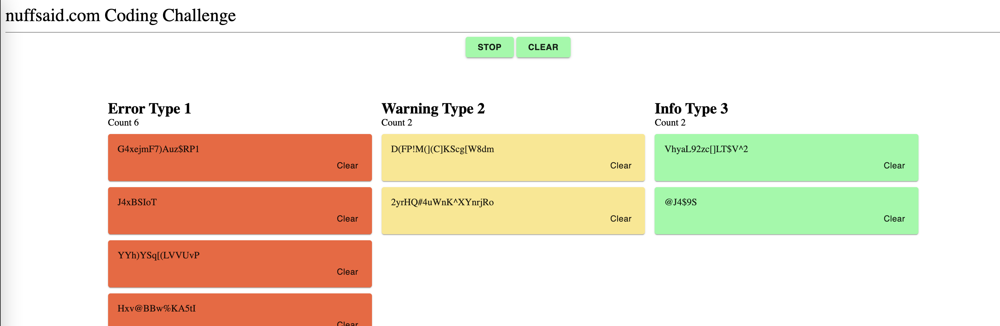

## React Coding Challenge

This code challenge tests your skills in react.js (using Typescript), testing and modular design.
The purpose of the application is to correctly render a stream of messages coming from an api. Different messages will be coded different colors and require slightly different rendering. The rules are described in detail below.

This challenge already includes an API response. It is not required or expected for you to make any changes to this interaction.

The 3 priorities that we provide you are:
  * 0 = error
  * 1 = warning
  * 2 = info

### Acceptance Criteria

1. Messages should be rendered in a table-like structure. The newest messages should appear at the top of their respective columns.
2. Provide test coverage of the components. 
3. Ensure UI Matches the image

### Note

1. The example design below.



2. The messages should be color coded depending on the priority of the message. The appropriate color per priority is:

   * error: #F56236
   * warning: #FCE788
   * info: #88FCA3
3. Each time a message with the priority level of error is received, a snackbar containing the error message should also appear at the top right of the application. The error should disappear in 2 seconds, when another error message takes its place, or when the user clears it via the provided button located in the error message.
4. A user should be able to clear all messages at any point.
5. A user should be able to clear a specific message in a specific column
6. A user should be able to start and stop incoming messages. By default the messages should be running and displaying on the grid. The start/stop button should update depending on the state of the feed.
7. A user should see a count of specific messages in each column
8. Use material-ui components and styled-component styles
9. Write meaninful and useful unit tests. `jest` is already included in the project
10. Use functional components
11. Improve code structure. Your implementation should be more like how you do it for any production grade application development
12. Define Typescript types where necessary
13. Please submit your code either via Github or Gitlab
14. Use React context API and hooks to showcase your understanding of these React features
15. Pay attention to performance of your page rendering
16. "nunffsaid.com Coding Challenge" is part of the design. Make sure that you dont miss that header

***Applicants are provided this challenge with no expectation on deadline. Please take the time you need to complete the challenge to the best of your ability.***
----

### Demo 🚀 
[Demo Online](https://build-jero786.vercel.app)

### Setup

`yarn`

### Start

`yarn start`;

### Test & Test with Coverage
```
yarn test
yarn test:coverage
```

### Roadmap task
- [x] Review the requirements.
- [x] Implement React UI component (most of them created followed by TDD).
- [x] Implement UI design with pixel perfect.
- [x] clean-up package.json.
- [x] Implemented folder structure by types (components, types, contexts, etc).

### Out of scope roadmap task
- [ ] React Router for routing between pages.
- [ ] Configure project with prettier/husky/eslint (pre-commit).
- [ ] Should standardize in a better way spacing, font size, colores, etc.
- [ ] To deal in easy and safe way with Immutability, I like to use [Immer](https://immerjs.github.io/immer/). 
- [ ] E2E Test with [Cypress](https://www.cypress.io/).
- [ ] Server State should be implemented using [React Query](https://react-query.tanstack.com).
- [ ] UI State, currently implemented with Context API, should be implemented by [Jotai](https://github.com/pmndrs/jotai) (much simpler, easy to think/follow and more powerful tool than React Context).
- [ ] Adding snapshots to freeze pixel perfect implementation.
- [ ] i18n stuff.
- [ ] Configure Styles Component with more friendly class names.

### Justification of coding, best-practices, code smells and architectures followed 💡
- Followed as much as possible [SRP](https://en.wikipedia.org/wiki/Single-responsibility_principle) (single responsibility principle). Each "thing" (React component, class, Hook, functions, etc) should be written in their right level of abstraction, should be do one thing well.
- Followed [Kiss principle](https://en.wikipedia.org/wiki/KISS_principle) principle, trying to keep your code really clean and simple as possible.
- I created most of the application (related to behavior and user content) guided by TDD. After that, I moved to the styling part. If you want to know more about the benefit of TDD, I wrote [this article](https://jero786.medium.com/some-fundamental-benefits-of-tdd-ca6c17016dfc).
- I use to build most of my application represented by pure functions and immutable objects/props (notice I used a lot `read-only with Typescript). . Immutability + Pure function + Readable names + Modular applications === predictable, scalable and robust solutions === Happy programmers and clients :)
- Trying to type as much as you can, that help us to catch errors in compilations instead of runtime. Also, Typescript help us to avoid the [billion-dollar mistake](https://www.youtube.com/watch?v=ybrQvs4x0Ps) problem.
- Another benefit, among others, to type your code is that forces you to re-think the API of your objects/React component/etc. Also, create a solid/clear contract between the consumer and the objects that you defined (In this case React Component, functions, etc). 
- We should create our objects/React components properly from their initialization, in a simple but extensible way. If you want to know more about some of these heuristics/best practices with objects I wrote several in [this article](https://jero786.medium.com/the-principal-oop-design-principles-by-hernan-wilkinson-122c5480c3ac) (yeah I like to combine my OOP and FP skills  :) ).
- Separation of concerns between Containers and Dump Components, UI state logic (Context API) and UI-Server logic (API original file logic). 
- Due to the size of the project I decided to organize the folders by type. But, keep in mind that is not the only way to do that, you could follow by features and separate your projects in separate modules and commons modules as well. For more details, I wrote a little bit about it [here](https://jero786.medium.com/duck-re-duck-183da6e5a35a).

### Testing best practices
- Test should follow the SRP principle too. Do one thing, test one thing.
- Test files, should be ended with *.test.tsx and should be placed in the same folder from their SUT (Subject under test).
- Keep in mind the implicit structure of test must be AAA (Arrange, Act, Assert).
- Each test must be isolated, means that one test not be dependent to another in order to get given result, therefore it should not matter the order of execution of them.
- Each test should be solid and not fragile, should be keep working after structure refactoring.
- Should not fall in testing implementation details.
- The test should not be have false positives and false 
- Avoid global variables. Instead, declare them in setup method.
- Follow the DRY principle (Don’t Repeat Yourself). If we identify that we have repeated code throughout our tests use beforeEach function to put the code in one place.
- Putting comments in the header of the test is an anti-pattern, avoid them.
 
NOTE: For more detail I wrote the following articles related to testing:
- [Write Test, not too many Mostly integration.](https://jero786.medium.com/write-test-not-too-many-mostly-integration-bad298f69e1a)
- [React-Testing-Library — Pro tips](https://jero786.medium.com/react-testing-library-pro-tips-eba7181eb6fb)
Yes I'm fun of Kent D and Dan :) 